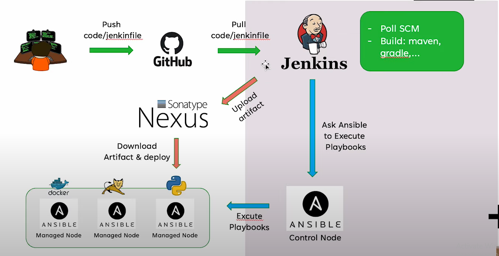

# devops[^1]
- **DevOps** is a full lifecycle investment, a team undertaking, enables better software development & delivery practices, accelerates the last mile of continous delivery

- **What we need?**
  - **Learn the culture:**
    - Concept
    - Motivation
    - Factor Influencing
    - Barriers
  - **Learn Server Administrator:**
    - Linux OS
    - Linux Commands
    - File, permission, network
    - ...
  - **Learn Webserver, Network, Protocol:**
    - TCP/IP
    - SSL, SSH, FTP...
    - Firewall, Load Balancer
    - Apache, Tomcat, IIS...
  - **Learn Scripting & Programing language**
  - **Learn Git**
  - **Learn Container Architect:**
    - Docker
    - K8s
    - Rancher
  - **Learn Configuration Mgmt:**
    - Ansible
    - Chef
    - Puppet
  - **Learn Cloud:**
    - Google Cloud
    - AWS
- **CI/CD:**
  - Continuous Integration
  - Continuous Delivery
  - Continuous Deployment
    
  

- **IaC Concepts - Infrastructure as Code**

- **PaC Concepts - Policy as Code**

- **Chosen pipeline**

    
[^1]: [Tìm hiểu và triển khai thử DevOps pipeline cho một bài toán Python Flask](https://www.youtube.com/watch?v=1Nx7wjL0Pks)
